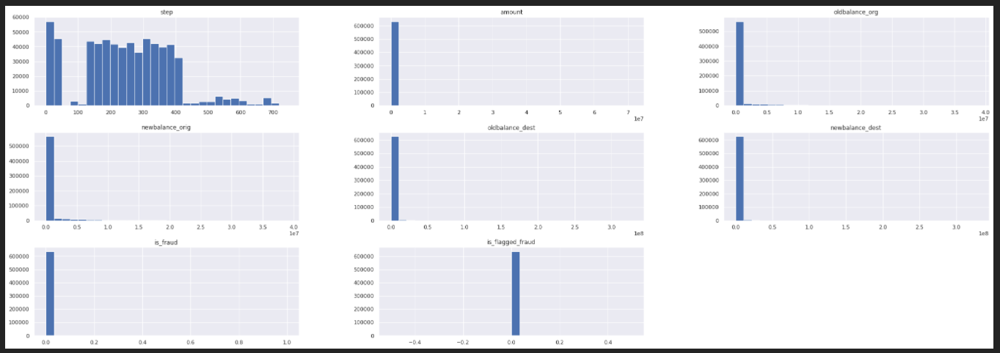
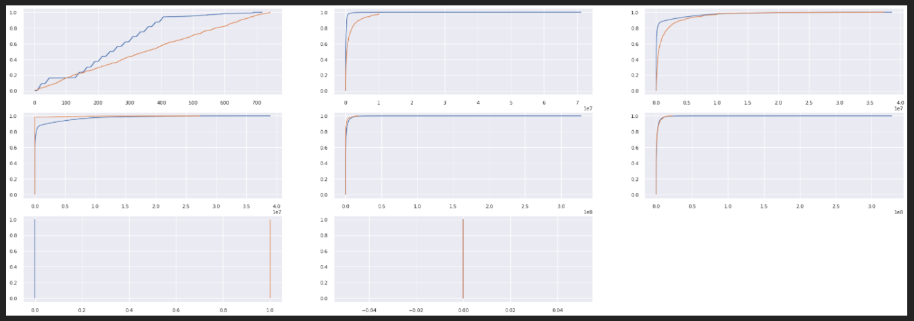

# Fraud Blocker

## Introduction

This repository contains the solution for this business problem (in portuguese): https://bit.ly/34V6Wpw

This project is part of the "Data Science Community" (Comunidade DS), a study environment to promote, learn, discuss and execute Data Science projects. For more information, please visit (in portuguese): https://sejaumdatascientist.com/

**Project Development Method**

The project was developed based on the CRISP-DS (Cross-Industry Standard Process - Data Science, a.k.a. CRISP-DM) project management method, with the following steps:

- Business Understanding
- Data Collection
- Data Cleaning
- Exploratory Data Analysis (EDA)
- Data Preparation
- Machine Learning Modelling and fine-tuning
- Model and Business performance evaluation / Results
- Model Deploy

# 1. Business Problem.

The Blocker Fraud Company is a specialized company in fraud detection on financial transactions. It has the Blocker Fraud service, which ensures the block of fraudulent transactions. The company's business model is service's performance monetization.

# 2. Business Assumptions.

The company aims to expand its business, by following the given rules:
1. The company receives 25% of each transaction value truly detected as fraud.
2. The company receives 5% of each transaction value detected as fraud, however the transaction is legitimate.
3. The company gives back 100% of the value for the customer in each transaction detected as legitimate, however the transaction is actually a fraud.

**Goal of the project**

- Create a model with high accuracy and precision with respect to transactions' fraud detection.

**Deliverables**

- A model that classifies the transactions as "Fraud" or "Legitimate".
- Deployed model with API access. The API must inform "Fraud" or "Legitimate" when the transaction is inputed.
- A Readme about how to use the tool.
- Model performance and results report with respect to profit and loss. The following questions must be answered:

    - What is the model's precision and accuracy?
    - What is the model's reliability with respect to transactions' classification as legitimate or fraudulent?
    - What is the Blocker Fraud Company forecasted revenue using the model?

# 3. Solution Strategy

My strategy to solve this challenge was:

**Step 01. Data Description and Partition:**

The dataset file has 470 MB, and when loaded in pandas it has a memory usage of 534 MB. Available RAM memory is crucial to run the code properly. In order not to compromise it, the dataset was saved several times, as the preprocessing was completed, to allow a viable timeline for code execution. Hence, before executing the code it is important to check the available space in HD / memory and how much it will take. The strategy to save the preprocessed dataset and execute the code in steps worked properly in the computer used to develop this project (SSD 240GB, RAM memory 8GB), but it may change depending on the hardware used.

As described in the lessons learned section, the way the dataset is handled is crucial for the model training and hence for the project success. In this case, some attemps were made until reaching the expected performance to meet the project goal.

The dataset was split into train and test set with 70/30 ratio.

**1.1. PySpark**

A superficial descriptive analysis is performed to check the distribution of each feature and the proportions of categorical features throughout the data.

**1.1. StratifiedKFold**

By dividing the data in two 1/10 part of the total dataset, there is the creation of viable parts of data that remain representative of the fenomenon, given that the stratified k-fold takes samples with balances betweeen categorical features, as close to the original data.

**1.2. Descriptive Statistics**
There are 3 data types in the dataset: float64(5), int64(3) and object(3). The dataset does not have NA values, as shown in the image above.

**Summary Statistics:**

**Histogram:**

**Cumulative distribution plots:**

**Step 02. Feature Engineering:**

- As previously checked in the data description, some amount transactions are higher than the origin banlance before the transaction. Also, there are amount instances equal to zero. Theoretically, the difference between the origin balance before and after the transaction should be equal to the transaction amount. Therefore, a new feature will be created to check this.

- The same is true for the destination balance: theoretically, the difference between the destination balance after and before the transaction should be equal to the transaction amount. Therefore, a new feature will be created to check this.

- As stated above in the features description, the balance destination information for merchant customers is not available. Therefore, a new feature will be created to differentiate such customers to the ordinary ones.

- A new time feature can be created based on the step information to determine the day in which the transactions happened, in order to ease the analysis.

**Step 03. Data Filtering:**

The variables filtering step aims to remove the outliers from the dataset.

As previously checked in the descriptive statistics, some features have a huge range of values, particularly the amount, destination balance before the transaction (oldbalance_dest) and the destination balance after the transaction (newbalance_dest), as shown in the boxplot below.

The three boxplots show clearly that the higher the values, the lower the quantity of observations. It is important to note, however, that this is an intrinsic beahviour of banking account, as there is theoretically no limit to transfer or to have a certain amount of money.

Therefore, the line filtering was applied in order to help the model to be trained properly, but also cautiously not to mischaracterize the inherent dataset / problem property.

- Amount: filtered values below 20 million;
- oldbalance_dest: filtered values below 50 million;
- newbalance_dest: filtered values below 50 million.

**Step 04. Exploratory Data Analysis:**

**Step 05. Data Preparation:**

**Step 06. Feature Selection:**

Before using the methods for feature selection, I removed unnecessary features still present in the data:
- step (because day feature was created on it);
- day (because day_sin and day_cos were created on it);
- name_orig and name_dest (based on data analysis, they will not be considered to train the model).

In the second step, the target variable was detached from the training set, in order to allow the model to be trained (section 6).

Two feature selection tools were applied to select the most relevant features:

1. Random Forest as Feature Selector
A Random Forest Classifier was trained and then the feature importance obtained. The plot below shows the feature importance according to the Random Forest classification:

2. Boruta as Feature Selector

The features selected by Boruta are among the top 7 features selected by the random forest:

Finally, wiht the above-mentioned results and based on the EDA analsysis, the features selected by the Random Forest Classifier were chosen to train the model.

**Step 07. Machine Learning Modelling:**

1. KNN
2. Random Forest
3. XGBoost
4. LightBoost
5. CatBoost

**Step 08. Hyperparameter Fine Tunning:**

1. Random Search

**Step 09. Convert Model Performance to Business Values:**

1. Testing with "test" dataset (~600k transations)

2. Testing with entire data (~6M transations)

**Step 10. Deploy Modelo to Production:**

# 4. Top 3 Data Insights

**Hypothesis 01:**

**True/False.**

**Hypothesis 02:**

**True/False.**

**Hypothesis 03:**

**True/False.**

# 8. Conclusions

# 9. Lessons Learned

# 10. Next Steps to Improve

# LICENSE

# All Rights Reserved - Comunidade DS 2021
