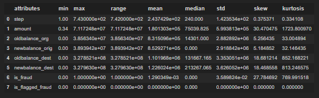
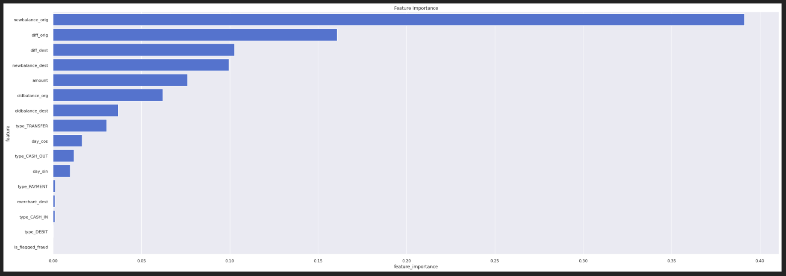
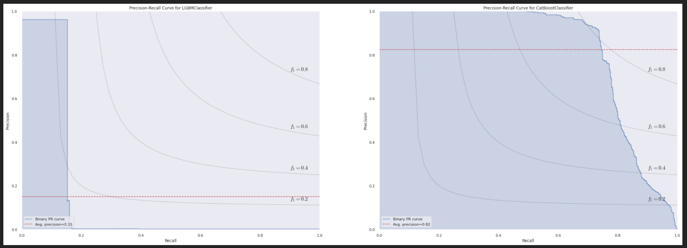
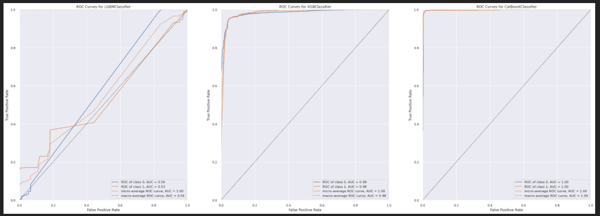
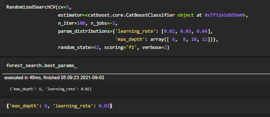
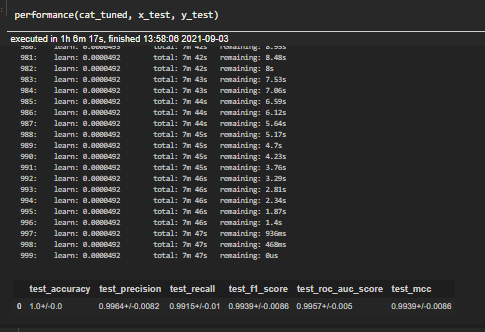

# Fraud Blocker

---

## Table of Contents
- [Introduction](#introduction)
- [1. Business Problem](#1-business-problem)
- [2. Business Assumptions](#2-business-assumptions)
- [2. The Dataset](#2-the-dataset)
- [3. Feature Engineering and Variables Filtering](#3-feature-engineering-and-variables-filtering)
- [4. EDA Summary and Insights](#4-eda-summary-and-insights)
- [5. Data Preparation and Feature Selection](#5-data-preparation-and-feature-selection)
- [6. Machine Learning Modelling and Fine Tuning](#6-machine-learning-modelling-and-fine-tuning)
- [7. Business Performance and Results](#7-business-performance-and-results)
- [8. Next Steps](#8-next-steps)
- [9. Lessons Learned](#9-lessons-learned)
- [10. Conclusion](#10-conclusion)
- [References](#references)

---

**Project Development Method**

This project is based on the CRISP-DS (Cross-Industry Standard Process - Data Science, a.k.a. CRISP-DM) project management method, with the following steps:

- Business Understanding
- Data Collection
- Data Cleaning
- Exploratory Data Analysis (EDA)
- Data Preparation
- Machine Learning Modelling and fine-tuning
- Model and Business performance evaluation / Results
- Model Deploy

# 1. Business Problem.

This given case is one of a company specialized in fraud detection for financial transactions. The company's business model is based on performance monetization.

# 2. Business Assumptions.

The company aims to expand its business, by following the given rules:
1. The company receives 25% of each transaction value truly detected as fraud.
2. The company receives 5% of each transaction value detected as fraud, however the transaction is legitimate.
3. The company gives back 100% of the value for the customer in each transaction detected as legitimate, however the transaction is actually a fraud.

**Goal of the project**

- Create a model with high accuracy and precision when classifying transaction between fraud and non-fraud.

**Deliverables**

- A model that classifies the transactions as "Fraud" or "Legitimate".
- Deployed model with API access. 
- A Readme about how to use the tool.
- Model performance and results report with respect to profit and loss. 

# 3. Solution Strategy Step by Step

**Step 01. Data Description and Partition:**

The dataset file has 470 MB, and when loaded in pandas it has a memory usage of 534 MB. Available RAM memory is crucial to run the code properly. In order not to compromise it, the dataset was saved several times, as the preprocessing was completed, to allow a viable timeline for code execution. Hence, before executing the code it is important to check the available space in HD / memory and how much it will take. The strategy to save the preprocessed dataset and execute the code in steps worked properly in the computer used to develop this project (SSD 240GB, RAM memory 8GB), but it may change depending on the hardware used.

As described in the lessons learned section, the way the dataset is handled is crucial for the model training and hence for the project success. In this case, some attemps were made until reaching the expected performance to meet the project goal.

The dataset was split into train and test set with 70/30 ratio. 

**1.1. PySpark**

A superficial descriptive analysis is performed to check the distribution of each feature and the proportions of categorical features throughout the data.

**1.1. StratifiedKFold**

By dividing the data in two 1/10 part of the total dataset, there is the creation of viable parts of data that remain representative of the fenomenon, given that the stratified k-fold takes samples with balanced categorical features, keeping the data set as close as possible to the original data.

**1.2. Descriptive Statistics**
There are 3 data types in the dataset: float64(5), int64(3) and object(3). 

**Summary Statistics:**

**Histogram:**

**Cumulative distribution plots:**

**Step 02. Feature Engineering:**

- As previously checked in the data description, some amount transactions are higher than the origin balance before the transaction. Also, there are amount instances equal to zero. Theoretically, the difference between the origin balance before and after the transaction should be equal to the transaction amount. Therefore, a new feature will be created to check this.

- The same is true for the destination balance: theoretically, the difference between the destination balance after and before the transaction should be equal to the transaction amount. Therefore, a new feature will be created to check this.

- As stated above in the features description, the balance destination information for merchant customers is not available. Therefore, a new feature will be created to differentiate such customers to the ordinary ones.

- A new time feature can be created based on the step information to determine the day in which the transactions happened, in order to ease the analysis.

**Step 03. Data Filtering:**

The variables filtering step aims to remove the outliers from the dataset.

As previously checked in the descriptive statistics, some features have a huge range of values, particularly the amount, destination balance before the transaction (oldbalance_dest) and the destination balance after the transaction (newbalance_dest), as shown in the boxplot below. The three boxplots show clearly that the higher the values, the lower the quantity of observations. It is important to note, however, that this is an intrinsic beahviour of banking account, as there is theoretically no limit to transfer or to have a certain amount of money.

Therefore, the line filtering was not applied in order to keep the data as close as possible to the phenomenon that we are trying to model.

**Step 04. Exploratory Data Analysis:**

**Step 05. Data Preparation:**

**Step 06. Feature Selection:**

Before using the methods for feature selection, I removed unnecessary features still present in the data:
- step (because day feature was created on it);
- day (because day_sin and day_cos were created on it);
- name_orig and name_dest (based on data analysis, they will not be considered to train the model).

In the second step, the target variable was detached from the training set, in order to allow the model to be trained (section 6).

Two feature selection tools were applied to select the most relevant features:

1. Random Forest as Feature Selector
A Random Forest Classifier was trained and then the feature importance obtained. The plot below shows the feature importance according to the Random Forest classification:

2. Boruta as Feature Selector

The features selected by Boruta are among the top 7 features selected by the random forest:

Finally, wiht the above-mentioned results and based on the EDA analsysis, the features selected by the Random Forest Classifier were chosen to train the model.

**Step 07. Machine Learning Modelling:**

The following models were trained to solve the fraud detection task:

1. Logistic Regression
2. KNN
3. Random Forest
4. XGBoost
5. LightBoost
6. CatBoost

All the models were evaluated with cross-validation through sklearn's `cross_validate` using 10-fold cross validation.

More information about sklearn's metrics and model evaluation on this [link](https://scikit-learn.org/stable/modules/model_evaluation.html).

The following metrics were used to evaluate the models' performance:

- **Accuracy**

The accuracy represents the ratio between the correctly predicted instances and all the instances in the dataset:

Even though accuracy (ratio of correct predictions) was one of the metrics used to evaluate the models, it is actually not the proper metric for problems with a skewed dataset, specially for high-skewed data such fraud transactions. This is so because more than 99% of the instances have target equal zero (legitimate transaction). Hence, even if the model make all precitions as "zeros", the accuracy will be 99%, but the model actually does not detect the fraud itself, which can lead to a false impression that the model works and lead also to wrong decisions.

- **Precision**

The precision refers to the positive predicted instances: the ratio between the instances correctly predicted as positive (true positive) and all predicted instances (true positive + false positive). A model with a perfect precision should have zero false positives.

- **Recall**

The recall is also called sensitivity or true positive rate and it measures the ratio that the model detects true positives with respect to the actual positives (true positive + false negative). A model with a perfect recall should have zero false negatives, that is, should correctly detect all fraudulent transactions. Hence, it is the best metric to evaluate a model to be applied to solve fraud detection problems.

- **F1-Score**

The F1-Score is the harmonic mean of precision and recall. Whereas the regular mean treats all values equally, the harmonic mean gives much more weight to low values. As a result, the classifier will only get a high F1 Score if both recall and precision are high [[2]](#references).

- **ROC-AUC**

The ROC-AUC is the area under the curve (AUC) of the receiver operating characteristic (ROC) and it is another way to compare classifiers. The ROC curve plots the true positive rate against the false positive rate. A perfect classifier will have a ROC AUC equal to 1, whereas a purely random classifier will have a ROC AUC equal to 0.5. In this project, the ROC-AUC was computed with sklearn's `roc_auc_score()` function.

- **Matthews Correlation Coefficient (MCC)**

The Matthews Correlation Coefficient (MCC) is a measure to evaluate the quality of a two class / binary classifier, and ranges from -1 (inverse prediction) to +1 (perfect prediction), whereas 0 indicates a random prediction. It takes into account the four confusion matrix categories (TP, TN, FP and FN), proportionally both to the size of positive elements and the size of negative elements in the dataset [[3]](#references). The MCC is calculated according to the formula below:

- **Confusion Matrix**

The confusion matrix is a 2x2 matrix that shows the predicted values of the estimator with respect to the actual values. Each element of the matrix is a category as described below:

- True Positive (TP): actual positives that are correctly predicted as positive;
- False Positive (FP): actual negatives that are wrongly predicted as positive;
- True Negative (TN): actual negatives that are correctly predicted as negative;
- False Negative (FN): actual positives that are wrongly predicted as negative.

Sklearn's `confusion_matrix()` function uses the following convention for axes:

**Step 08. Performance Analysis:**

**Step 09. Hyperparameter Fine Tunning:**

Hyperparameter fine-tuning is performed so that we can improve performance in comparison to the model with default hyperparameters.

There are three main ways to perform hyperparameter fine-tuning: random search, grid search and Bayesian search.
In grid search all predefined hyperparameters are combined and evaluated through cross-validation. It is a competent way of finding the best hyperparameters combinations, however it takes a long time to be completed. Bayesian search optimizes this process by adding bayesian theory in the process of selecting the best parameters to cross-validate.
In random search, the predefined hyperparameters are randomly combined and then evaluated through cross-validation. It may not find the best optimal combination, however this process is much faster than the others and it is largely applied, being competent in increasing performance to the best fitting model.

In this project, the sklearn's `RandomizedSearchCV` was initially applied, however it did not work as expected and therefore was not able to complete the task. Hence, the code lines were removed in order to keep the functional script in the notebook. This problem is probably due to: 1. the size of the dataset and 2. The computer memory.

As the random search executes a cross-validation for each iterations (i.e., for each random hyperparameter combination), the execution and values are stored in the RAM memory, which due to the size of the dataset cannot afford all these steps. Hence, in order to experiment other hyperparameter combinations rather than the default one, three combinations were randomly set and evaluated on the test set, as shown below.

**Step 10. Convert Model Performance to Business Values:**

1. Testing with "test" dataset (~600k transations)

2. Testing with entire data (~6M transations)

**Step 11. Deploy Modelo to Production:**

# 4. Conclusions

# 5. Lessons Learned

# LICENSE

# All Rights Reserved - Comunidade DS 2021
